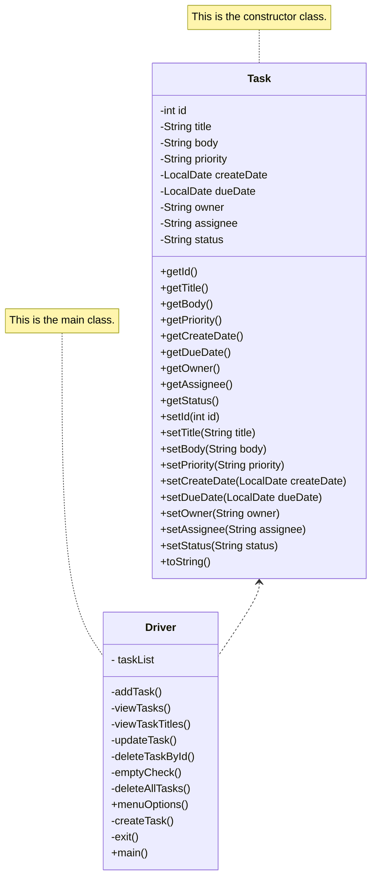
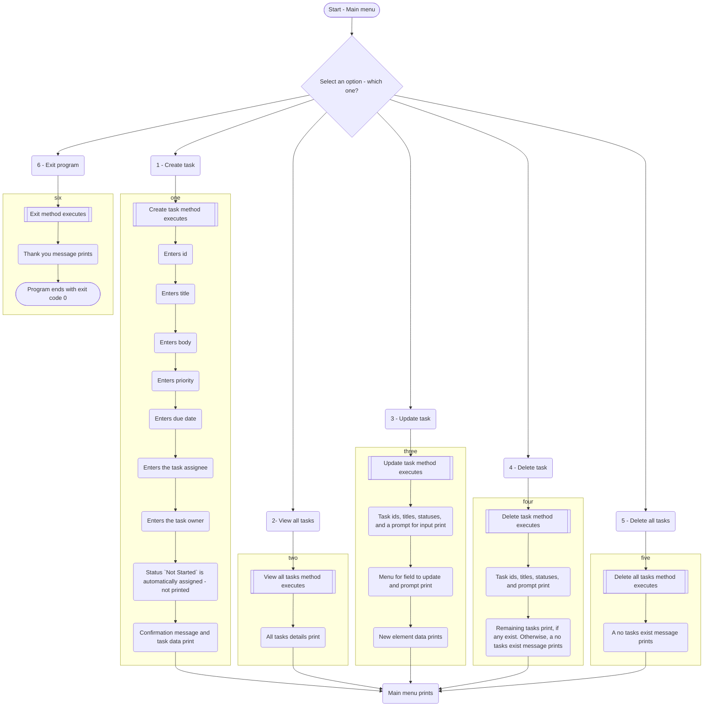

# Term Project "Task Management" TDD

The purpose of this document is to describe the structure of the Task Management program.

## Purpose

The program is a prototype for a task management program. Users may perform the following actions:
- Create new tasks
- Save tasks to an ArrayList
- View existing task details
- Update individual tasks
- Delete individual tasks
- Delete all tasks

All actions take place in IntelliJ, as this is a prototype.

## Architecture

The core of the program consists of the following:
- A driver class that executes the logical flow of the program and contains methods for handling task data
- A constructor class that contains getter and setter methods for creating, viewing, updating, and deleting Task objects and elements

When objects are created, updated, or deleted, the task list ArrayList is updated to reflect the changes. 

Since this is a prototype that does not include file handling, the contents of the task list only exist in memory. The contents disappear when the program stops running.

Try/catch statements are in place to gracefully exit the program when an exception occurs. 

Note that the following are out of scope for this project:
- Input validation
- File handling
- Frontend/user interface

### Class diagram

The diagram below demonstrates the relationship between the classes.

## User journey

When the user starts the program, the user is prompted with a menu of actions the user can take. When the user selects
an action, a switch statement identifies which method to execute based on the user's input. The following flowchart identifies the happy path for each menu option.

### Flowchart

## Tech stack

- Backend: 
  - Java (JDK 20)
- Frontend substitute:
  - Intellij IDEA - displays output and gets user input
