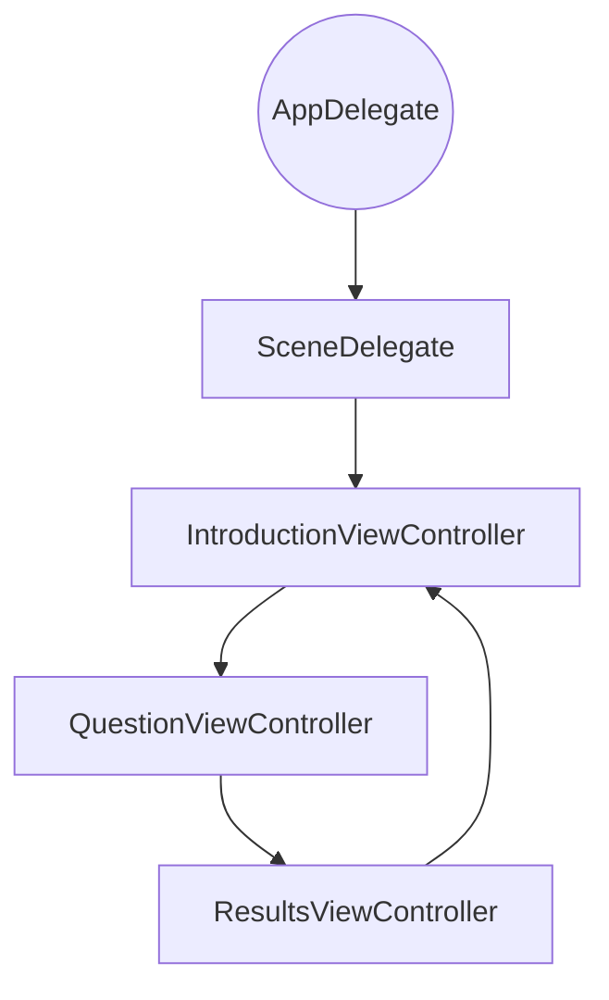
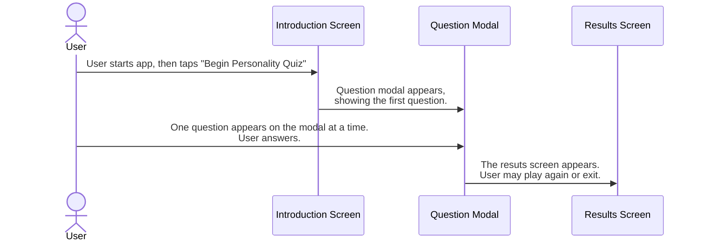

# Personality Quiz Project Technical Design Document

The purpose of this document is to outline the design and workflow for the personality quiz project, a project for the Intro to Swift and App Development course. The personality quiz potential results include the following animals:
    - cat
    - dog
    - rabbit
    - turtle

## Features

The user should be able to do the following:

1. See what the quiz is about
2. View quiz questions and provide answers
3. View quiz results

## Workflow

1. Display a start screen that includes:
    - the quiz title
    - the quiz description
    - an image
    - a button call-to-action, which takes the user to the next screen
2. Display a question screen that displays one question and multiple possible answers per screen. Additional requirements include the following:
    - The user should only be able to select one option per question. 
    - The app should save the user's response. 
    - The user should be able to go back to previous questions and change answers before the results screen.
3. Display a results screen. The results should include the following:
    - What animal the user is
    - An emoji of the animal
    - A way to exit the app or start over again

## Views

This section describes the input controls that the views have.
- Question 1 has radio selector types so that the user may select only one option.
- Question 2 has switches so that the user may select multiple options.
- Question 3 features a slider option, on a scale of 0 to 1.
- Question 4 has radio selectors, like Question 1 does.

## Data Models

The data models include the following:

- A Question struct
    - Defines Question objects (and leverages the ResponseType and AnimalType structs)
- An Answer struct
    - Defines Answer objects
- A ResponseType struct
    - Outlines the response types included in the quiz
- An AnimalType struct
    - Includes an enumeration that provides the descriptions of each animal type.

### Logic and Structure

The results are determined by how many times the user selected a response corresponding to a specific animal. If there is a tie between two animals, either one is an appropriate result. A function tallies the most common answer and saves it to a dictionary.

The flow of the app in terms of its subclasses and view controllers is represented in the following flowchart. Note that these subclasses inherit from parent classes; details about these parent classes are not included in this document.

#### Flowchart with Subclasses

#### Sequence Diagram

### Constraints

The final result may only be one animal.
